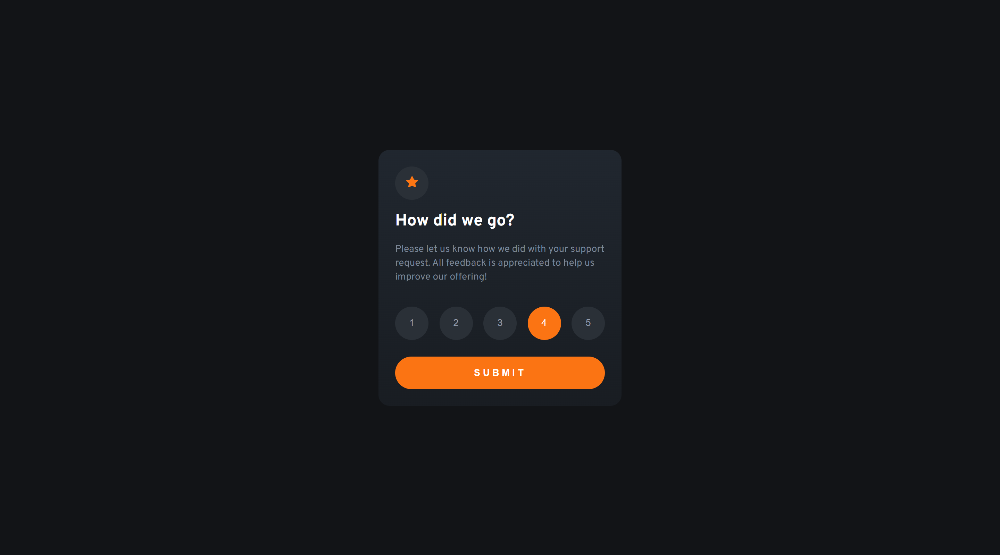
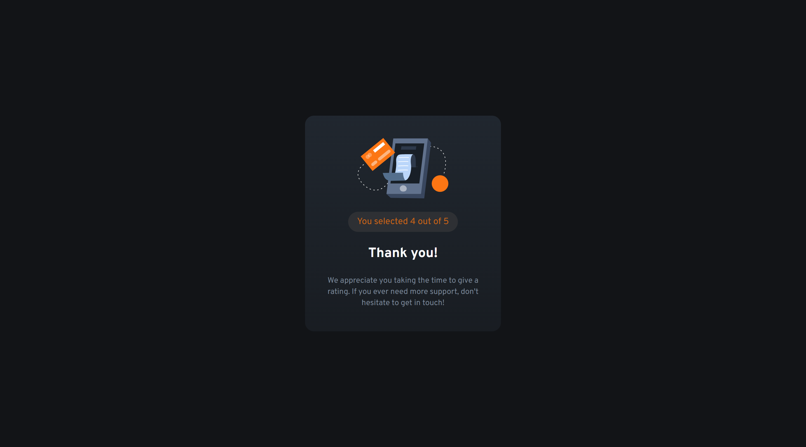
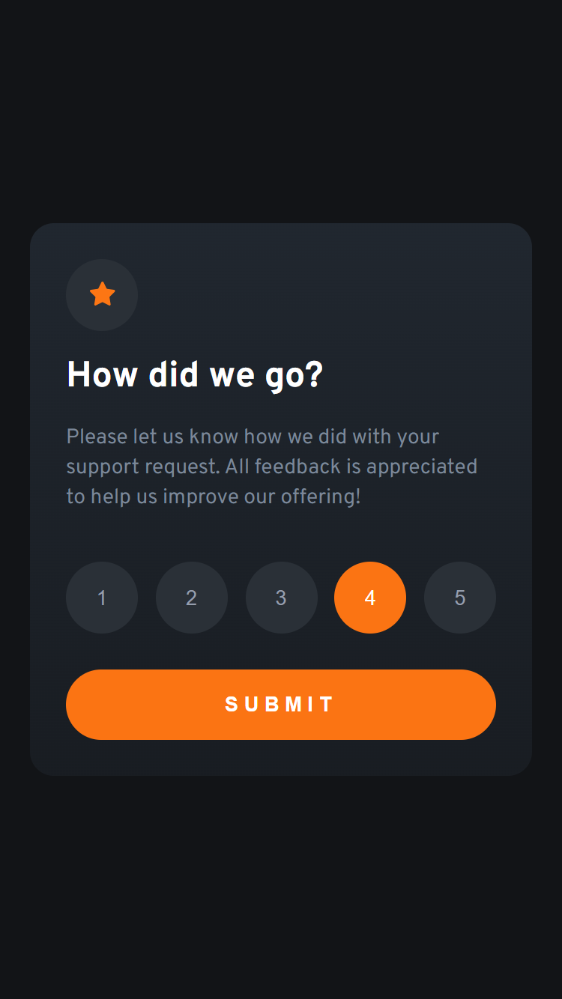
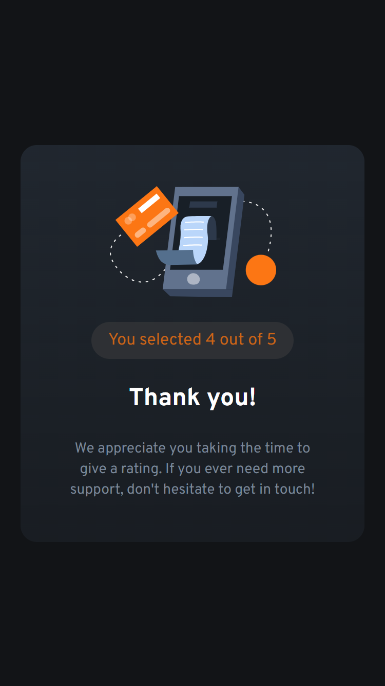

# Frontend Mentor - Interactive rating component solution

This is a solution to the [Interactive rating component challenge on Frontend Mentor](https://www.frontendmentor.io/challenges/interactive-rating-component-koxpeBUmI). Frontend Mentor challenges help you improve your coding skills by building realistic projects. 

## Table of contents

- [Overview](#overview)
  - [The challenge](#the-challenge)
  - [Screenshots](#screenshots)
  - [Links](#links)
- [My process](#my-process)
  - [Built with](#built-with)
- [Author](#author)

## Overview

### The challenge

Users should be able to:

- View the optimal layout for the app depending on their device's screen size
- See hover states for all interactive elements on the page
- Select and submit a number rating
- See the "Thank you" card state after submitting a rating

### Screenshots

### Links

- Solution URL: [Frontend Menotr SOlution]([https://your-solution-url.com](https://www.frontendmentor.io/solutions/interactive-rating-component-react-sass-gsap-PtBbbOzOge))
- Live Site URL: [Interactive Rating in Vercel]([https://your-live-site-url.com](https://frontend-mentor-interactive-rating-ten.vercel.app/))

## My process

### Built with

- Semantic HTML5 markup
- CSS custom properties
- Flexbox
- Mobile-first workflow
- [Vite](https://vitejs.dev/) - Building tool
- [React](https://reactjs.org/) - JS library
- [Sass](https://sass-lang.com/) - For styles
- [GSAP](https://greensock.com/gsap/) - For animations
- [Vercel](https://frontend-mentor-interactive-rating-ten.vercel.app/) - For deploy

## Author

- Frontend Mentor - [@tomascarrizodev](https://www.frontendmentor.io/profile/tomascarrizodev)
- LinkedIn - [Tomás Carrizo](https://www.linkedin.com/in/tomascarrizodev)
